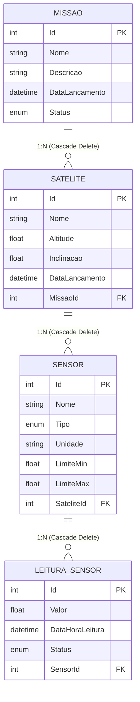

# SatMonitor API

API REST para monitoramento de satélites e sensores orbitais, desenvolvida em .NET 10 com Entity Framework Core e banco de dados Oracle.

> Global Solution 2026/1 — FIAP | Advanced Business Development with .NET

---

## 👥 Integrantes

| Nome | RM |
|------|----|
| Leonardo José Pereira | RM563065 |
| Pedro Henrique de Oliveira | RM562312 |
| Fabricio Henrique Pereira | RM563237 |
| Henrique Sinkevicius Maran | RM562977 |
| Miguel Henrique Oliveira Dias | RM565492 |

---

## 🎥 Vídeos

| Vídeo | Link |
|-------|------|
| Demonstração (8 min) | [Assistir no YouTube](https://www.youtube.com/watch?v=U1nMVM0tUJg) |
| Pitch (3 min) | [Assistir no YouTube](https://www.youtube.com/watch?v=n7JltNHvWcQ)|

---

## 🗺️ Diagrama de Domínio



---

## 🏗️ Arquitetura

```
SatMonitor/
└── src/
    ├── SatMonitor.Domain/          # Entidades e Enums
    ├── SatMonitor.Application/     # DTOs e Interfaces de serviço
    ├── SatMonitor.Infrastructure/  # DbContext, Migrations e implementações
    └── SatMonitor.Api/             # Controllers, Middlewares e Program.cs
```

**Fluxo de dependências:**
```
Api → Infrastructure → Application → Domain
```

Application define os contratos (interfaces). Infrastructure os implementa com acesso ao banco. Domain não depende de nenhuma camada externa.

---

## 🚀 Como Executar

### Pré-requisitos
- .NET 10 SDK
- Acesso ao Oracle Database (FIAP)

### Configuração

1. Clone o repositório:
```bash
git clone https://github.com/leojp04/SatMonitor.git
cd SatMonitor
```

2. Crie o arquivo `src/SatMonitor.Api/appsettings.json` baseado no `appsettings.example.json`:
```json
{
  "ConnectionStrings": {
    "OracleConnection": "Data Source=oracle.fiap.com.br:1521/orcl;User Id=SEU_RM;Password=SUA_SENHA;"
  }
}
```

3. Rode a API:
```bash
dotnet run --project src/SatMonitor.Api
```

> As migrations são aplicadas automaticamente na inicialização. O banco é populado com dados de seed (3 missões, 3 satélites, 4 sensores e 26 leituras) caso esteja vazio.

4. Acesse o Swagger:
```
http://localhost:5291/swagger
```

> Swagger disponível apenas em ambiente Development.

---

## 📡 Endpoints

### Missoes
| Método | Rota | Descrição |
|--------|------|-----------|
| GET | /api/Missoes | Lista todas as missões |
| GET | /api/Missoes/{id} | Busca missão por ID |
| POST | /api/Missoes | Cria nova missão |
| PUT | /api/Missoes/{id} | Atualiza missão |
| DELETE | /api/Missoes/{id} | Remove missão (cascade delete em satélites) |

### Satelites
| Método | Rota | Descrição |
|--------|------|-----------|
| GET | /api/Satelites | Lista todos os satélites |
| GET | /api/Satelites/{id} | Busca satélite por ID |
| GET | /api/Satelites/missao/{missaoId} | Lista satélites de uma missão |
| POST | /api/Satelites | Cria novo satélite |
| PUT | /api/Satelites/{id} | Atualiza satélite |
| DELETE | /api/Satelites/{id} | Remove satélite (cascade delete em sensores) |

### Sensores
| Método | Rota | Descrição |
|--------|------|-----------|
| GET | /api/Sensores | Lista todos os sensores |
| GET | /api/Sensores/{id} | Busca sensor por ID |
| GET | /api/Sensores/satelite/{sateliteId} | Lista sensores de um satélite |
| GET | /api/Sensores/{id}/estatisticas | Retorna média, mín, máx e contagem por status |
| POST | /api/Sensores | Cria novo sensor |
| PUT | /api/Sensores/{id} | Atualiza sensor |
| DELETE | /api/Sensores/{id} | Remove sensor (cascade delete em leituras) |

### Leituras
| Método | Rota | Descrição |
|--------|------|-----------|
| GET | /api/Leituras | Lista todas as leituras |
| GET | /api/Leituras/{id} | Busca leitura por ID |
| GET | /api/Leituras/sensor/{sensorId} | Lista leituras de um sensor |
| GET | /api/Leituras/status/{status} | Filtra leituras por status (Normal/Alerta/Critico) |
| POST | /api/Leituras | Registra nova leitura (status calculado automaticamente) |
| DELETE | /api/Leituras/{id} | Remove leitura |

---

## 🧪 Exemplos de Teste

### 1. Criar Missão
```http
POST /api/Missoes
Content-Type: application/json

{
  "nome": "Missão Sentinel-1",
  "descricao": "Monitoramento climático orbital",
  "dataLancamento": "2024-03-15T00:00:00",
  "status": "Ativa"
}
```

### 2. Criar Satélite
```http
POST /api/Satelites
Content-Type: application/json

{
  "nome": "SAT-BR-01",
  "altitude": 550.5,
  "inclinacao": 97.6,
  "dataLancamento": "2024-06-01T00:00:00",
  "missaoId": 1
}
```

### 3. Criar Sensor
```http
POST /api/Sensores
Content-Type: application/json

{
  "nome": "Sensor Térmico Principal",
  "tipo": "Temperatura",
  "unidade": "°C",
  "limiteMin": -60.0,
  "limiteMax": 80.0,
  "sateliteId": 1
}
```

### 4. Registrar Leitura (status calculado automaticamente)
```http
POST /api/Leituras
Content-Type: application/json

{
  "valor": -45.7,
  "dataHoraLeitura": "2024-06-15T14:30:00",
  "sensorId": 1
}
```

### 5. Filtrar leituras por status
```http
GET /api/Leituras/status/Alerta
```

### 6. Estatísticas de um sensor
```http
GET /api/Sensores/1/estatisticas
```

---

## 🔧 Endpoint de Reset (Development only)

```http
DELETE /dev/reset
```

Limpa todos os dados do banco. Disponível apenas quando `ASPNETCORE_ENVIRONMENT=Development`.

---

## 🛠️ Tecnologias

- .NET 10
- ASP.NET Core Web API
- Entity Framework Core 10
- Oracle Database
- Swagger / OpenAPI


